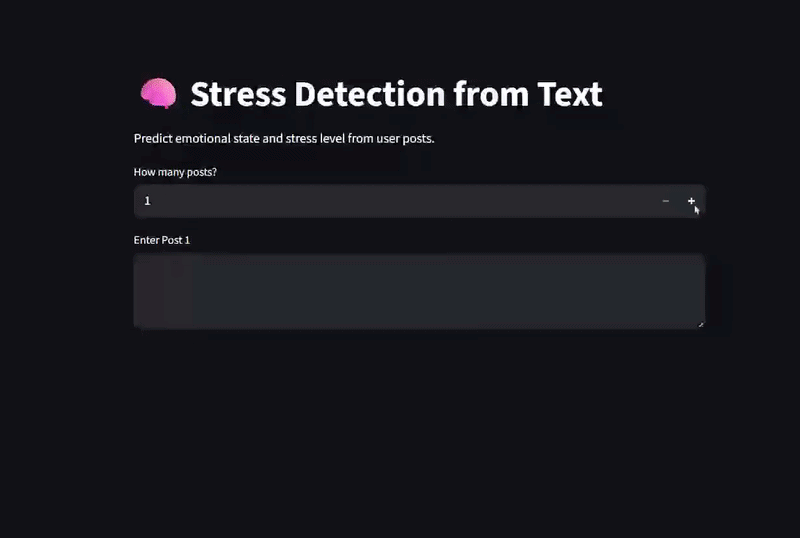

# 🧠 Community Stress Tracker AI


**Live Demo:** [Community Stress Tracker AI- Streamlit](https://community-stress-tracker-ai.streamlit.app/)


Community Stress Tracker AI converts everyday text into measurable community stress insights, helping reveal broader emotional patterns at scale. The system aggregates these signals across multiple inputs to provide a broader view of stress patterns, with the goal of supporting meaningful insights for social good.

---

## Overview

This project was developed as part of a beginner-friendly hackathon, [**Predict4Good**](https://predict4good-hackathon.devpost.com/?_gl=1*yooc35*_gcl_au*MTkyNjE2NjIxOC4xNzc0NzkwMjcw*_ga*MjYyMTMyNjIuMTc3NDc5MDI3MQ..*_ga_0YHJK3Y10M*czE3NzQ3OTAyNzEkbzEkZzEkdDE3NzQ3OTMwNDMkajMwJGwwJGgw), which focused on building predictive solutions that address real-world problems. By leveraging Natural Language Processing (NLP), it shows how machine learning can turn messy social media text into actionable insights about community stress trends.

The system is designed to:
- Identify emotional signals from text using a trained model (DistilBERT)
- Convert these signals into quantitative stress scores
- Normalize and aggregate results to reflect overall stress trends in a community

By combining prediction with simple aggregation logic, the project demonstrates how data-driven approaches can contribute to understanding mental well-being in everyday contexts.

---

## Problem Statement

Mental health signals are often expressed through informal and messy text, such as social media posts or personal messages. However, these signals are difficult to analyze at scale and are rarely translated into interpretable metrics.

This project addresses this gap by providing a method to:
- Detect emotional patterns from text  
- Quantify stress levels in a consistent way  
- Aggregate signals across multiple inputs to estimate community-level stress trends

By extending analysis beyond individual posts, the system enables a broader understanding of how stress manifests across groups or shared spaces. This can help identify periods of heightened distress, recurring emotional patterns, or shifts in collective well-being over time.

Such insights can be valuable to researchers, organizations, and platforms that aim to monitor and respond to mental health signals at scale. In this way, the project demonstrates how predictive and data-driven approaches can contribute to early awareness and support efforts that promote community well-being.

---

## Approach and Prediction Logic

The system follows a structured, data-driven pipeline:

1. Text preprocessing to standardize input (*Lowercasing, whitespace removal, emoji and emoticon conversion, and removal of user mentions*)
2. Conversion of the textual labels (*Suicidal, Depressed, Anxious, Frustrated, Others*) into numeric form using label encoding
3. Tokenization using a pretrained DistilBERT tokenizer  
4. Emotion classification using a fine-tuned DistilBERT model  
5. Mapping predicted labels to stress scores (1–5 scale)  
6. Normalizing scores to a 0–10 range  
7. Aggregating scores to estimate overall stress levels  

We process posts in batches of 16 to compute mean stress, making the aggregation efficient for community-level trends. Overall, this approach combines machine learning with simple logic-based aggregation, making it both interpretable and practical for real-world use.

---

## Label Encoding

The categorical labels were encoded using a label encoder, and this mapping was saved to ensure consistent predictions during model deployment as `label.mapping.json`:

| Labels     | IDs |
|------------|-----|
| Anxious    | 0   |
| Depressed  | 1   |
| Frustrated | 2   |
| Others     | 3   |
| Suicidal   | 4   |

---

## Model and Implementation

The project uses DistilBERT for sequence classification. The model is trained on a labeled dataset named [MentalDistress](https://data.mendeley.com/datasets/b42wr437hg/2), a curated and annotated English dataset categorized into five psychological states and containing mental health-related categories, and optimized using class-weighted loss to address imbalance. We also performed basic hyperparameter tuning (learning rate, batch size, and epochs) to identify an optimal configuration, which was then used to train the model and save the weights for deployment.

| Hyperparameters | Tested Range        | Optimal Settings |
|-----------------|---------------------|------------------|
| Learning Rate   | 2e-5, 3e-5, 5e-5    | 3e-5             |
| Batch Size      | 16, 32              | 32               |
| Epochs          | 3, 4, 5             | 4                |
| Max Length      | 128, 256            | 256              |

The implementation focuses on:
- Clear and modular code structure
- Reproducible preprocessing and evaluation steps
- Efficient inference using saved model weights
- Deployment through Streamlit for real-time interaction using the saved model weights

The system is fully functional and allows users to input text and receive immediate predictions along with stress analysis.

---

## Features

- Transformer-based emotion classification
- Stress scoring and normalization
- Aggregation of multiple inputs into a single stress indicator
- Interactive web interface using Streamlit

---

## Project Structure
```
├── app.py # Streamlit application
├── distilbert_emotion_model.pth # Trained model weights
├── label_mapping.json # Label encoding mapping
├── mental_distress_test_set.csv # Test dataset
├── Mental_Distress_Dataset-original.csv # Original raw dataset
├── Mental_Distress_Dataset_updated.csv # Updated and preprocessed dataset with null rows dropped
├── Notebooks # Colab notebook folder
    ├── com_stress_fullTraining_notebook.ipynb # Training and experimentation from scratch
    ├── com_stress_modelLoading_notebook.ipynb # Training and experimentation using saved trained model
├── README.md
```

---

## Installation

Install the required dependencies in your local terminal:
```
pip install streamlit transformers torch emoji emoticon_fix pandas scikit-learn gdown
```

---

## Running the Application Locally

To launch the application: `streamlit run app.py`

---

## Stress Scoring Scheme

| Emotion     | Score |
|------------|------|
| Suicidal   | 5    |
| Depressed  | 4    |
| Anxious    | 3    |
| Frustrated | 2    |
| Others     | 1    |

We map emotional states to numeric scores based on their severity level and then normalize them to a 0-10 scale. Aggregating across posts allows us to capture the overall community stress trend.

---

## Use Cases

- Monitoring stress patterns from textual inputs  
- Supporting exploratory analysis in mental health research  
- Building tools that promote awareness of emotional well-being  
- Demonstrating predictive and data-driven solutions for social impact  

---

## Limitations

The system relies solely on textual input and may not capture the full context of an individual’s mental state. Predictions should be interpreted as indicative rather than definitive.

---

## Disclaimer

This project is created for the hackathon purpose, intended for educational and research purposes only. It is not a substitute for professional mental health advice, diagnosis, or treatment.

---

## Future Work

- Incorporating time-based tracking for trend analysis
- Extending to community-level dashboards
- Integrating additional datasets for improved generalization
- Exploring explainable AI techniques for transparency

These improvements aim to provide communities and researchers with a clearer, real-time picture of mental well-being trends.

---

**Project Contributors:** Adrika Chowdhury and Tustee Mazumdar

---

## Acknowledgement

We sincerely thank the creators of the **MentalDistress** dataset for making their work publicly available, which made this project possible:

Prity, Fahmida Yeasmin; Munira, Tasmia Chowdhury; Ahmed Shayeed, Sayem; Chowdhury, Md Jalal Uddin (2026), “MentalDistress: A multi-class social media text dataset for mental health–related emotion detection”, Mendeley Data, V2, doi: 10.17632/b42wr437hg.2
